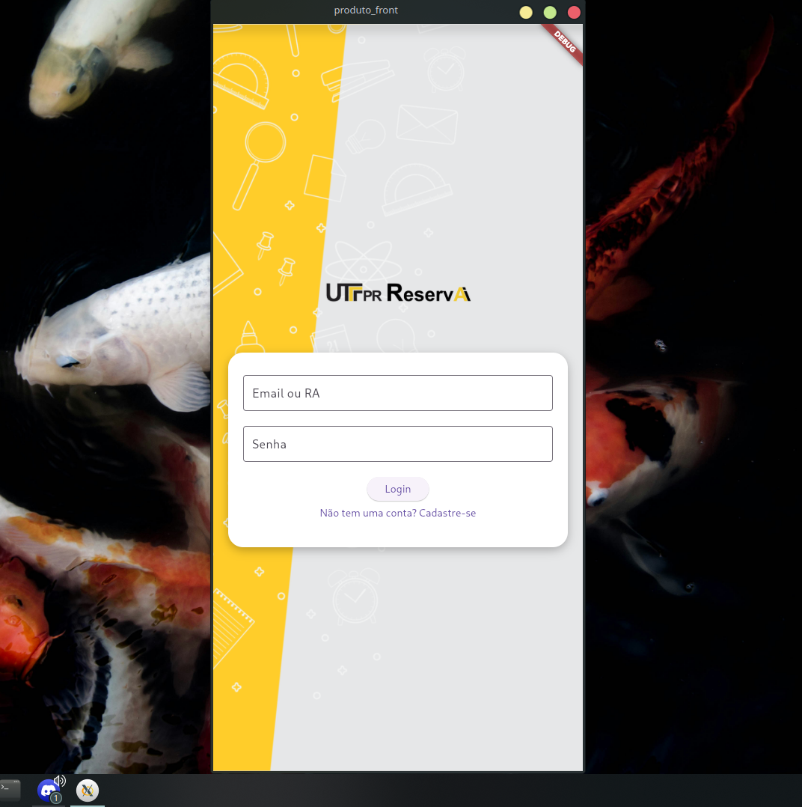
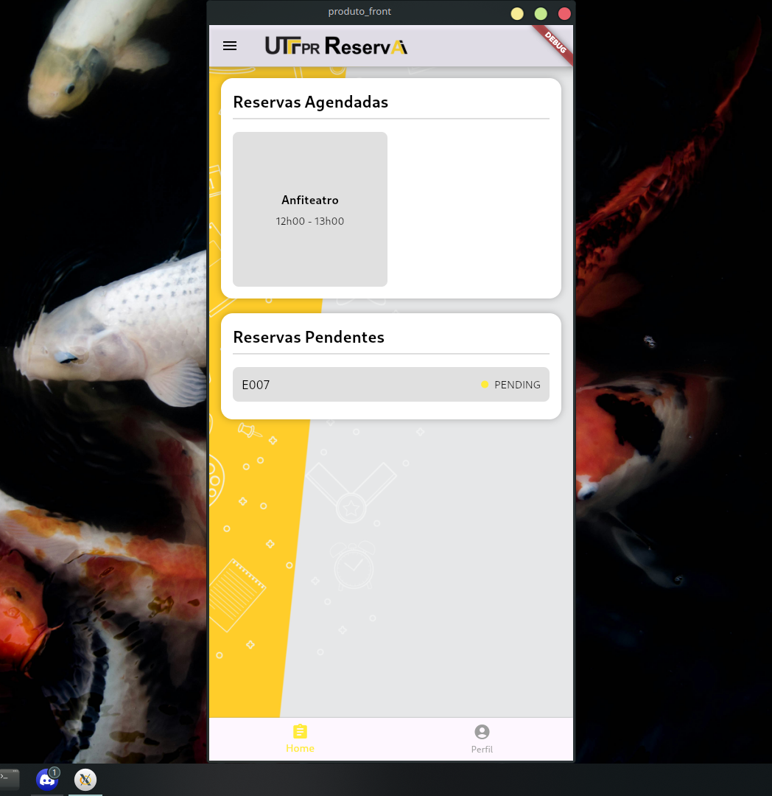

# UTF - ReservAi!
> Application developed for learning purposes at UTFPR - CM
Portuguese Readme:
[README_PT](README_PT.md)

## Description
ReservAi is an application for booking available rooms at UTFPR (Brazilian Federal College). Admins can approve or deny reservation requests, while students and faculty members, such as professors, can submit booking requests.

> Login:


## Features

- Login session with different user roles (Student, Faculty, Administrator)
  - Request token validation and middleware verification
- Create a reservation request
> Reservation request page


- List pending, canceled, denied, or approved reservations for the user
> HomePage:


- (Admin) View all reservation requests / Approve or deny requests
> Reservation request list page


## Project Structure
The application is structured into front-end and back-end. The front-end, developed by me, is available in this repository, while the back-end can be found here: [Backend Repository](https://github.com/afmireski/OPT120-projeto-final-api).

The *'\lib'* folder contains the front-end, structured with pages and components, developed using Flutter and TailwindCSS.

## Languages and Technologies
**Front-end:**
[](https://skillicons.dev)

**Back-end:**
[](https://skillicons.dev)

## Prerequisites
Make sure you have Flutter installed on your machine:
- [Flutter](https://docs.flutter.dev/get-started/install)

Run the project's back-end by following the step-by-step guide in the README: (https://github.com/afmireski/OPT120-projeto-final-api)

## Running Locally
Clone the repository:

```bash
  git clone https://github.com/femedici/utf_RESERVAI.git
```

Install Flutter dependencies:

```bash
  flutter pub get
```

Run the application using the Flutter extension in VSCode (recommended for better optimization).

## Author

- [@femedici](https://github.com/femedici)

