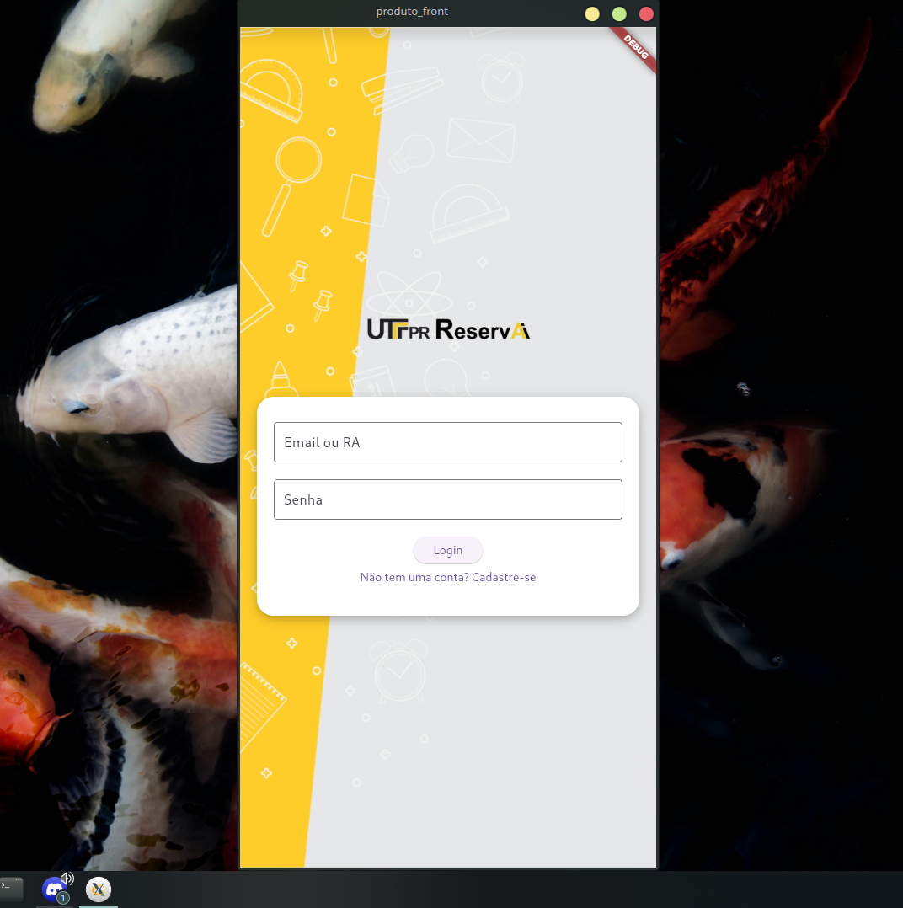
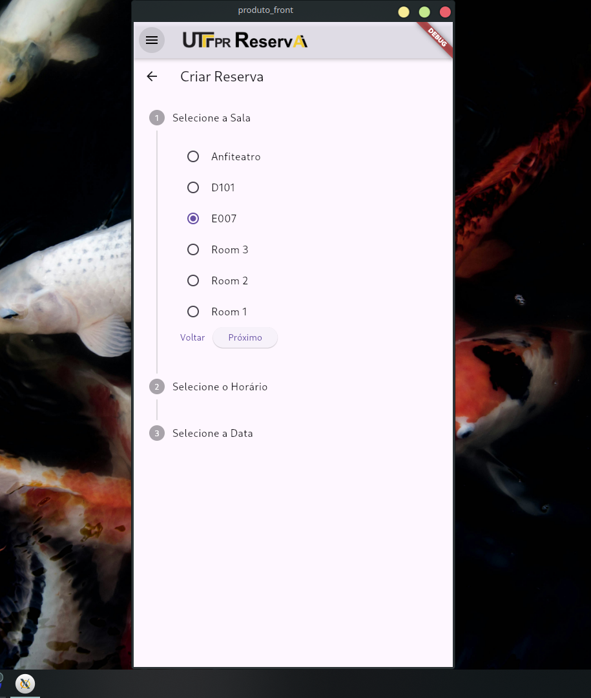
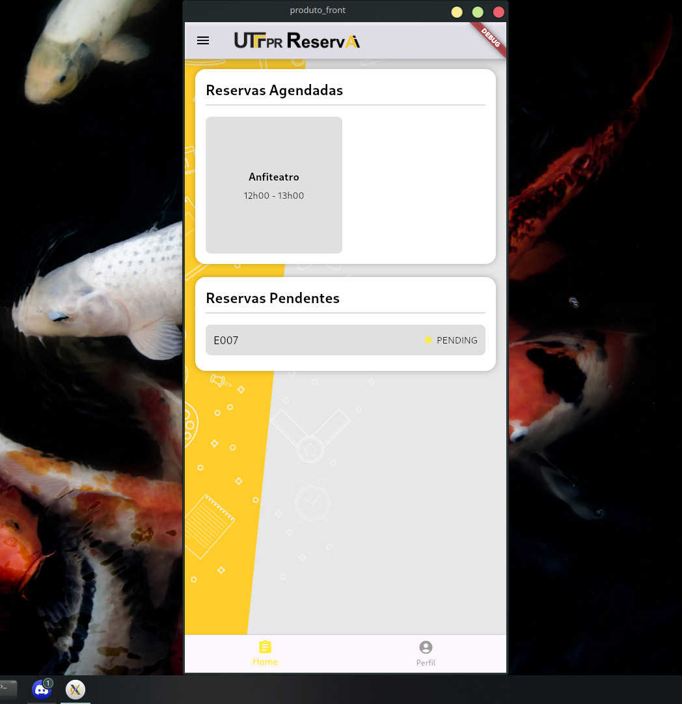
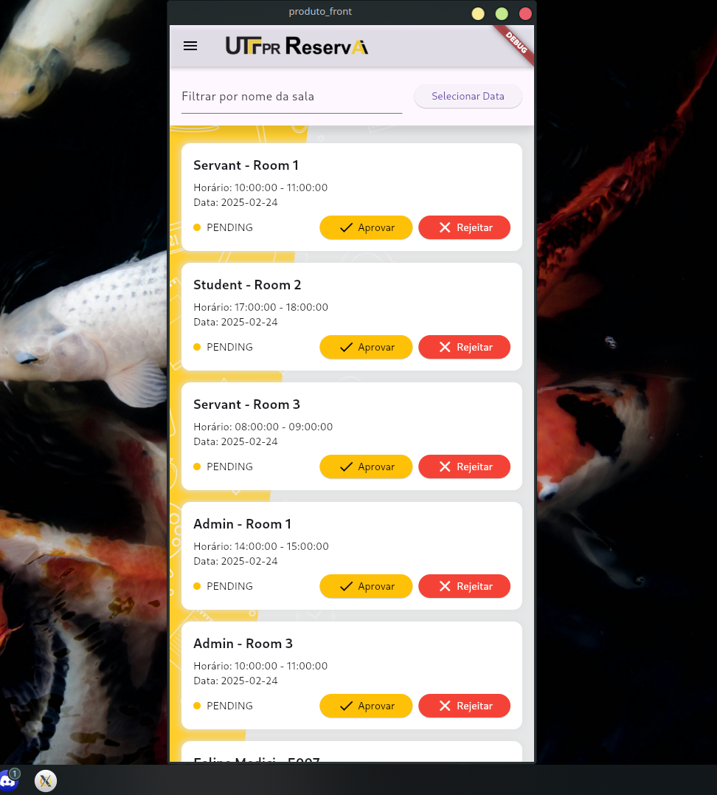

# UTF - ReservAi!
> Aplicação desenvolvida para aprendizado na UTFPR - CM

English README:
[Readme EN](README.md)

## Descrição
Aplicação para reserva de salas disponíveis na faculdade UTFPR. O administrador pode confirmar ou negar um pedido de reserva, enquanto alunos e servidores, como professores, podem requisitar reservas.

> Login:


## Funcionalidades

- Sessão de login com tipos de usuário (Aluno, Servidor, Administrador)
   - Validação por tipo de token da requisição e verificação por middleware 
- Criar um pedido de reserva
> Página para solicitar uma reserva


- Listar reservas em espera, canceladas, negadas ou aprovadas do usuário. 
> HomePage:


- (Adm) Listagem de pedidos de reserva / Aprovar ou negar pedidos
> Página de listagem de pedidos


## Estrutura do projeto 
A aplicação está estruturada em front-end e back-end, sendo o front-end desenvolvido por mim neste repositório e o back-end disponível em: [Repositório backend](https://github.com/afmireski/OPT120-projeto-final-api)

A pasta *'\lib'* contém o front-end, com páginas e componentes estruturados, desenvolvido em Flutter e TailwindCSS.

## Linguagens e Tecnologias
**Front-end:** 
[](https://skillicons.dev)

**Back-end:** 
[](https://skillicons.dev)

## Pré-requisitos
Instale o Flutter caso ainda não tenha na sua máquina:
- [Flutter](https://docs.flutter.dev/get-started/install)

Execute o back-end do projeto seguindo o passo a passo no README: (https://github.com/afmireski/OPT120-projeto-final-api)

## Rodando localmente
Clone o projeto:

```bash
  git clone https://github.com/femedici/utf_RESERVAI.git
```

Instale as dependências do Flutter:

```bash
  flutter pub get
```

Inicie o aplicativo utilizando a extensão do Flutter no VSCode (melhor otimizado).

## Autor

- [@femedici](https://github.com/femedici)

